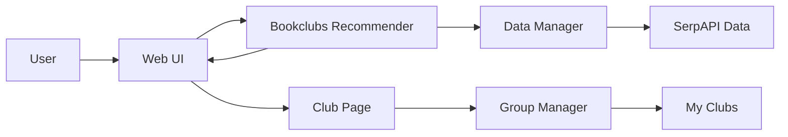
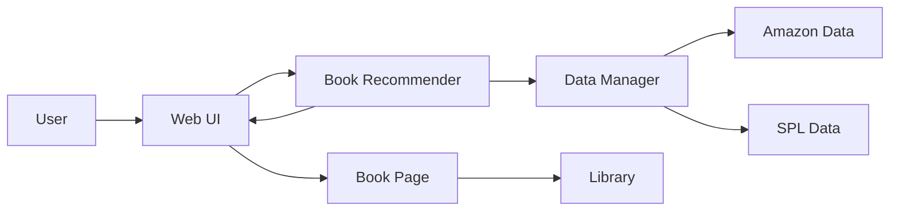
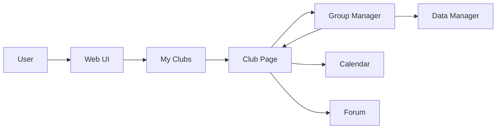

# Component Specifications
## Software Components

**Component 1:** Book Recommender

What it does: Helps users find new books they might be interested in reading based on personal preferences and public sentiment.
 
Input: User preferred genres (optional), user reading history (optional), book rating, book number of reviews, number of checkouts at SPL, number of bookclubs reading book

Outputs: Ranking of what books most likely will appeal to the user.

**Component 2:** Bookclub Recommender

What it does: Helps users find new bookclubs they might be interested in joining based on personal preferences.
 
Input: User preferred genres (optional), location, availability

Outputs: Ranking of what bookclubs most likely will appeal to the user.

**Component 3:** My Clubs / Individual bookclub pages

What it does: Organizes bookclubs user is in, placing them all in one centralized location to access.

Input: The bookclubs the user is part of as well as information specific to the books clubs such as schedule, location, and book being read.

Output: Page displaying bookclubs user is part of where they can see current book they are reading, schedule, location and click on specific bookclubs to access private bookclub forum discussion.

**Component 4:** Library

What it does: Tracks user reading history and bookmarked books. 

Input: What books the user has read, is currently reading, and is interested in reading in the future.

Output: Centralized area where user can reference and edit their reading history. Information used by book recommender to give personalized book recommendations. 

**Component 5:** Forum

What it does: Provides space for users to discuss books and coordinate bookclub logistics. 

Input: 
- Public -  title, genre (optional), book (optional), bookclub (optional) 
- Private - bookclub + members, title genre (optional), book (optional)  

Output: Tool for people on Bookish to connect and coordinate. 

**Component 7:** Individual Book Page

What it does: Provides more detailed  information about specific book including: description, SPL branches available at, bookclubs reading book if any. Note this is in addition to preview information showing title, cover image, rating, and genre. 

Input: Book meta data information, book SPL catalog data, and events data.

Output: Comprehensive overview of book so that users can quickly assess whether they are interested in the book. 

## Interactions

### Use Case 1: Find and join an active book club/event

1. User opens Bookish and optionally signs in.  
2. User enters preferences: genres/topics, neighborhood/location, and availability.  
3. System fetches clubs/events from the Bookclubs Recommender, which queries the Data Manager:
   - SerpAPI event listings (what, when, where, links, thumbnails)
   - Club metadata stored in Bookish (if available)  
4. System ranks results and displays descriptions.  
5. User clicks a club/event to view details.  
6. User taps Join (for Bookish-hosted clubs) or opens an external link for non-hosted clubs.  
7. System updates My Clubs and optionally prompts for notification/calendar preferences.  

### Use Case 2: Get personalized book recommendations and save to Library

1. User visits the Feed tab.  
2. User optionally selects genres/topics and/or imports reading history (or starts with none).  
3. System requests recommendations from the Book Recommender, which combines:
   - Amazon metadata (title, average_rating, rating_number, categories, images)
   - SPL checkout trends (Title, Subjects, Checkouts, PublicationYear)
   - Optional: books currently read by clubs the user follows  
4. Recommender suggests ranked books.  
5. User opens an Individual Book Page and clicks Save, choosing a status: Saved / In Progress / Finished.  
6. System updates the Library, which feeds back into future recommendations.  

### (Extra Implementation) Use Case 3: Coordinate a club reading plan (vote, schedule, and track progress)

1. User opens My Clubs and selects a club.  
2. On the club page, user navigates to Book Vote and proposes a book (search/select from Bookish catalog).  
3. System records votes, shows the current tally, and optionally sets a voting deadline.  
4. After voting ends, an admin confirms the selected book.  
5. User sets or edits the reading schedule (chapters per week and meeting dates).  
6. System writes events to the Calendar component and posts the plan to the club Forum.  
7. Members update reading progress; the club page surfaces aggregate progress to reduce confusion.  

